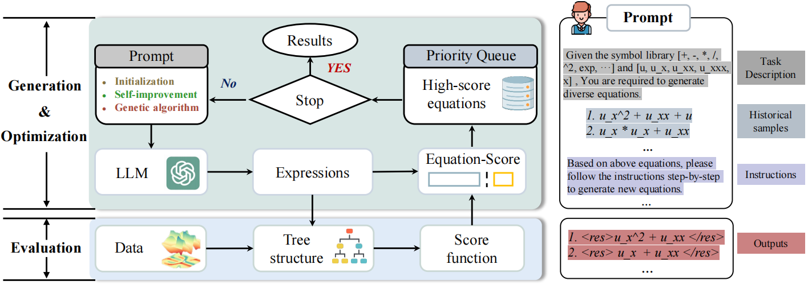

# EDL
## Large language models for automatic equation discovery of nonlinear dynamics

Equation discovery aims to directly extract physical laws from data and has emerged as a pivotal research domain in nonlinear systems. Previous methods based on symbolic mathematics have achieved substantial advancements, but often require handcrafted representation rules and complex optimization algorithms. In this paper, we introduce a novel framework that utilizes natural language-based prompts to guide large language models (LLMs) in automatically extracting governing equations from data. Specifically, we first utilize the generation capability of LLMs to generate diverse candidate equations in string form and then evaluate the generated equations based on observations. The best equations are preserved and further refined iteratively using the reasoning capacity of LLMs. We propose two alternately iterated strategies to collaboratively optimize the generated equations. The first strategy uses LLMs as a black-box optimizer to achieve equation self-improvement based on historical samples and their performance. The second strategy instructs LLMs to perform evolutionary operations for a global search. Experiments are conducted on various nonlinear systems described by partial differential equations, including the Burgers equation, the Chafee–Infante equation, and the Navier–Stokes equation. The results demonstrate that our framework can discover correct equations that reveal the underlying physical laws. Further comparisons with state-of-the-art models on extensive ordinary differential equations showcase that the equations discovered by our framework possess physical meaning and better generalization capability on unseen data.


## Framework
 

 This repository provides the code and data for following research papers:
Large language models for automatic equation discovery of nonlinear dynamics. [PDF](https://doi.org/10.1063/5.0224297)

## Reference
```bibtex
@article{10.1063/5.0224297,
    author = {Du, Mengge (都檬阁) and Chen, Yuntian (陈云天) and Wang, Zhongzheng (王中正) and Nie, Longfeng (聂隆锋) and Zhang, Dongxiao (张东晓)},
    title = {Large language models for automatic equation discovery of nonlinear dynamics},
    journal = {Physics of Fluids},
    volume = {36},
    number = {9},
    pages = {097121},
    year = {2024},
    month = {09},
    issn = {1070-6631},
    doi = {10.1063/5.0224297},
    url = {https://doi.org/10.1063/5.0224297},
    eprint = {https://pubs.aip.org/aip/pof/article-pdf/doi/10.1063/5.0224297/20152367/097121\_1\_5.0224297.pdf},
}

```